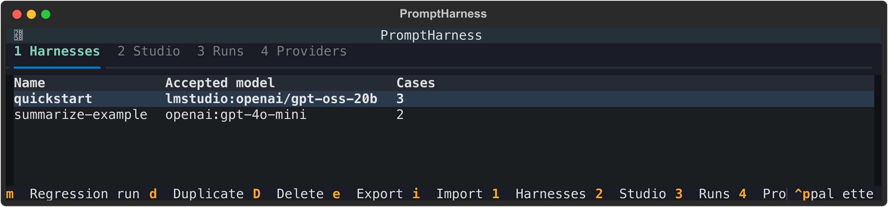
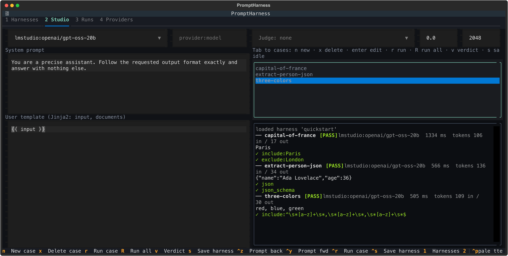
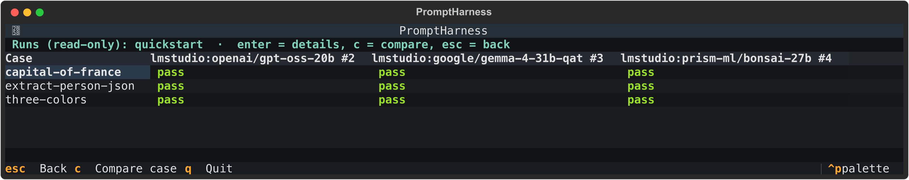
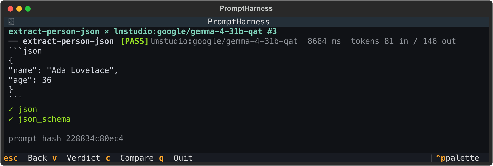
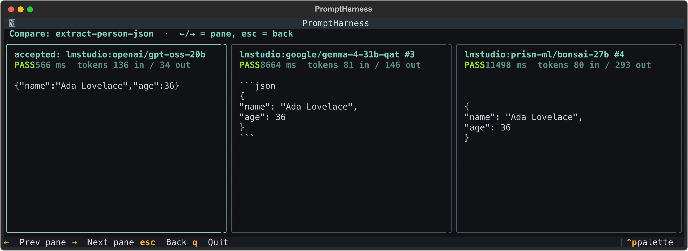
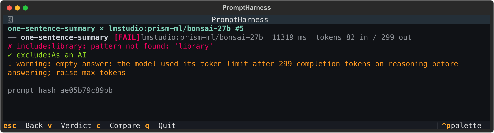
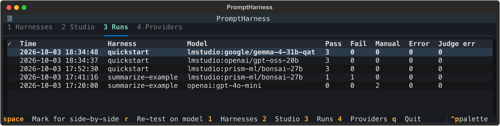
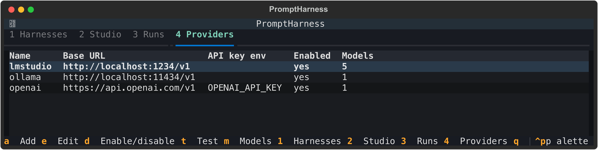

# PromptHarness

A local terminal app (Python, [Textual](https://textual.textualize.io/)) for iterating on an LLM prompt and then regression-testing it across models and providers.

You work out a prompt in a **studio** against a handful of test cases, save it as a **harness** with an accepted model and its accepted outputs, and later re-run that harness against other models (for example when a model is being replaced) to see which cases still pass and why the others do not. Everything works with any OpenAI-compatible chat completions endpoint (OpenAI, OpenRouter, Groq, Together, vLLM, Ollama, ...).

Nothing leaves your machine except requests to the provider base URLs you configure. There is no telemetry, cloud sync, account or web UI.

**New here? Follow the [Getting started guide](docs/getting-started.md)** for a step-by-step walk-through of your first test run, with screenshots. Then [Working with documents](docs/working-with-documents.md) shows how to test a prompt that reads Word, PDF and image files.

## Features

- **Studio:** edit a system prompt and a Jinja2 user template, attach test cases (inline text and/or documents), run one case or all, and step back through your prompt edits.
- **Documents:** attach text, PDF, Word, PowerPoint, Excel, OpenDocument and RTF files and images to a case, refer to them from the template, and send images to vision models. The judge sees them too.
- **Checks:** must-include / must-not-include (substring or regex), exact or normalized match, JSON and JSON Schema validity, an optional LLM judge on an independent model, and manual pass/fail.
- **Harnesses:** save a prompt, its cases, expectations, accepted model and accepted outputs, then re-run it against any mix of models and providers and read a case × model matrix.
- **Compare and re-test:** view outputs side by side against the accepted output, or copy a past run and swap the model to see if a replacement still passes.
- **Headless:** `promptharness run` exits non-zero on failures, so it works in CI.
- **Portable:** harnesses export to YAML or JSON so they can live in git. API keys are never stored, only the names of the environment variables that hold them.

## Screenshots

The screenshots show real results: the outputs, token counts and latencies come from runs of the [starter harness](#the-starter-test-case) against models served by LM Studio. The one exception is the `openai:gpt-4o-mini` row on the Runs tab, which is the accepted output bundled with the example harness. `scripts/make_screenshots.py` regenerates them.

**Harnesses** list saved prompts with their accepted model. `enter` opens one in the Studio and `m` starts a regression run.



**Studio:** edit the system prompt and template, keep a list of cases, and run one or all. Each result shows the output, token usage, latency and every check with its reason.



**Regression matrix:** one column per model and one row per case. `enter` opens a result and `c` compares a case across models.



**Result detail** shows the full output and which checks passed. Here the Gemma build wrapped its JSON in a markdown code fence, which the JSON check accepts.



**Compare** puts the accepted output first and the other models beside it, so you can see how a replacement model's answer differs.



**Warnings explain failures.** A reasoning model can use its whole token budget on hidden reasoning and return an empty answer. The result says so instead of only reporting that a pattern was not found.



**Runs** keeps the history of every run, with counts per status. Mark several with `space` to view them side by side, or press `r` to re-test a past run on a different model.



**Providers** are any OpenAI-compatible endpoint. Only the name of the API key variable is stored, and local servers need none.



## Install

Requires Python 3.11+.

**Install the app** (no clone needed; the starter harnesses are bundled with it):

```sh
uv tool install git+https://github.com/pmirvine/prompt-harness.git
```

or, without uv:

```sh
pip install git+https://github.com/pmirvine/prompt-harness.git
```

**Or work from a clone** to hack on it or run the tests:

```sh
git clone https://github.com/pmirvine/prompt-harness.git
cd prompt-harness
uv venv && uv pip install -e .
```

Launch the TUI:

```sh
promptharness            # from a clone: uv run promptharness
```

`promptharness --help` lists the subcommands (`run`, `export`, `import`, `examples`, `provider`).

## Quickstart

### The starter test case

PromptHarness ships a starter harness called `quickstart`, bundled with the package so it works after a normal install (its source is [`src/promptharness/examples/quickstart.harness.yaml`](src/promptharness/examples/quickstart.harness.yaml)). It is a model-agnostic smoke test of three tiny deterministic cases that any chat model should pass. It has no accepted model, so you choose what to try.

| Case | Prompt (abridged) | What it checks |
|------|-------------------|----------------|
| `capital-of-france` | "What is the capital of France? Answer with just the city name." | Output must include `Paris` and must not include `London` |
| `extract-person-json` | Extract `name` and `age` from "Ada Lovelace was 36 years old when she died." | Output must be valid JSON matching a schema (`name` string, `age` integer) |
| `three-colors` | "List exactly three different colors, lowercase, separated by commas." | Output must match a regex for `a, b, c` |

The shared prompt uses `temperature: 0.0` and `max_tokens: 2048`. The generous limit is deliberate, see the note on reasoning models below.

### Try it yourself

With a local server such as LM Studio, Ollama or vLLM running (LM Studio's server is on port 1234 by default):

```sh
# 1. Register the server (no API key needed locally)
promptharness provider add lmstudio --base-url http://localhost:1234/v1

# 2. Load the starter harness (promptharness examples lists the bundled ones)
promptharness import --example quickstart

# 3. Run it against a model you have loaded (provider:model)
promptharness run quickstart --model lmstudio:your-model-id
```

Replace `your-model-id` with an id from `curl http://localhost:1234/v1/models`, and change the base URL if the server runs on another machine. You should see:

```
case                 lmstudio:your-model-id
capital-of-france    pass
extract-person-json  pass
three-colors         pass
3 pass, 0 fail, 0 error, 0 judge_error, 0 manual
```

and exit code 0. A failure prints the reason underneath the table. To also exercise the LLM judge, add a `judge_prompt` to a case in the harness and pass `--judge lmstudio:your-model-id`.

In the TUI the same steps are: `4` then `a` to add the provider, `t` to fetch its models, `1` then `i` to import it (type `example:quickstart` in the box), and `m` to run it against one or more models.

**Reasoning models** (those that "think" before answering) spend part of `max_tokens` on hidden reasoning. If the limit is too low they return an empty answer. The quickstart sets `max_tokens: 2048` for this reason, and a result that hit the limit carries a warning such as `empty answer: the model used its token limit ... raise max_tokens`.

## API keys and environment variables

PromptHarness stores only the **name** of the environment variable that holds a provider's key, never the key itself. The key is read from the environment at the moment each request is made, so either export it in the shell you launch from or put it in a `.env` file (see [Using a `.env` file](#using-a-env-file)):

| Provider   | Typical env var name  |
|------------|-----------------------|
| OpenAI     | `OPENAI_API_KEY`      |
| OpenRouter | `OPENROUTER_API_KEY`  |
| Groq       | `GROQ_API_KEY`        |
| Together   | `TOGETHER_API_KEY`    |
| Local (vLLM, Ollama) | none required by the server |

The env var name is whatever you enter when adding the provider; the names above are conventions. If a provider has an env var name and that variable is unset, its requests fail with a per-case `error` ("environment variable ... is not set"). A local server such as vLLM or Ollama needs no env var: leave the name empty (omit `--api-key-env` on the CLI) and a placeholder key is sent.

### Using a `.env` file

[`.env.sample`](.env.sample) lists the base URL and key variable for OpenAI, Anthropic, Google Gemini, Amazon Bedrock, OpenRouter, Groq, Together, Mistral, xAI, DeepSeek, and local servers (LM Studio, Ollama, vLLM, llama.cpp).

PromptHarness loads a `.env` file automatically on startup, for the TUI and for every subcommand:

```sh
cp .env.sample .env          # .env is git-ignored
$EDITOR .env                 # replace the placeholder keys you need
promptharness                # run from the directory containing .env
```

Variables are looked up in this order, highest priority first:

1. variables already set in your shell (a `.env` never overrides them);
2. `./.env` in the directory you run `promptharness` from (parent directories are not searched);
3. `.env` in the PromptHarness data directory (see [Where data lives](#where-data-lives)), for keys you want available from any directory.

Empty values (`KEY=`) are treated as unset, values are never printed, and a missing `.env` is not an error. If a `.env` exists but cannot be read, a one-line warning naming the file goes to stderr.

Provider registration is unchanged: `promptharness provider add` still takes `--api-key-env` (the variable *name*). The `*_BASE_URL` lines in the sample are only a convenience. They are not read by PromptHarness, so to use them in `provider add`, load the file into your shell first:

```sh
set -a; source .env; set +a  # export the variables into this shell
promptharness provider add openai --base-url "$OPENAI_BASE_URL" --api-key-env OPENAI_API_KEY
```

Anthropic, Gemini and Bedrock are reached through their OpenAI-compatible endpoints, which can ignore or reject some OpenAI parameters; check each provider's documentation.

## Provider setup

Providers are managed on the Providers tab (`4`) or with `promptharness provider add`.

| Provider   | Name         | Base URL                          | Env var              |
|------------|--------------|-----------------------------------|----------------------|
| OpenAI     | `openai`     | `https://api.openai.com/v1`       | `OPENAI_API_KEY`     |
| OpenRouter | `openrouter` | `https://openrouter.ai/api/v1`    | `OPENROUTER_API_KEY` |
| Groq       | `groq`       | `https://api.groq.com/openai/v1`  | `GROQ_API_KEY`       |
| Together   | `together`   | `https://api.together.xyz/v1`     | `TOGETHER_API_KEY`   |
| vLLM (local)   | `vllm`   | `http://localhost:8000/v1`        | none (leave empty)   |
| Ollama (local) | `ollama` | `http://localhost:11434/v1`       | none (leave empty)   |
| LM Studio (local) | `lmstudio` | `http://localhost:1234/v1`   | none (leave empty)   |

In the TUI: press `4`, then `a`, fill in Name, Base URL and the API key env var **name** (empty for a local server), and save. Then press `t` to test the connection; on success the provider's model list is fetched and stored. If listing fails (some servers do not expose `/models`), the models editor opens so you can type model ids one per line (`m` reopens it later).

From the CLI:

```sh
promptharness provider add openai     --base-url https://api.openai.com/v1      --api-key-env OPENAI_API_KEY
promptharness provider add openrouter --base-url https://openrouter.ai/api/v1   --api-key-env OPENROUTER_API_KEY
promptharness provider add groq       --base-url https://api.groq.com/openai/v1 --api-key-env GROQ_API_KEY
promptharness provider add together   --base-url https://api.together.xyz/v1    --api-key-env TOGETHER_API_KEY
promptharness provider add vllm       --base-url http://localhost:8000/v1
promptharness provider add ollama     --base-url http://localhost:11434/v1
promptharness provider add lmstudio   --base-url http://localhost:1234/v1 --timeout 300
promptharness provider list
```

`provider add` on an existing name updates only the options you pass and keeps the rest (including whether it is enabled); it prints `Added` or `Updated`. `--max-tokens-param max_completion_tokens` (also a choice in the TUI form) sends the token limit as `max_completion_tokens`, which some newer OpenAI models require. Each request waits 60 seconds and is retried twice by default; `--timeout SECONDS` (greater than 0) and `--max-retries N` (0 or more) change that for one provider, for example `promptharness provider add lmstudio --timeout 300` for a slow local model (the Providers form has the same two fields, blank meaning the default). If a provider rejects a parameter (for example `temperature`), the request is retried without it and the result carries a `dropped param: ...` warning. Models are referred to everywhere as `provider:model`, for example `openai:gpt-4o-mini` or `ollama:llama3.2`.

## Key bindings

Global (on the main screen): `1` Harnesses, `2` Studio, `3` Runs, `4` Providers, `q` quit. The tab keys are disabled while a sub-screen or dialog is open. The footer always shows the keys available at the current focus. Dialogs close with `esc`.

| Screen | Key | Action |
|--------|-----|--------|
| Harnesses | `enter` | Open the harness in the Studio (with its accepted model) |
| | `m` | Regression run: pick models and an optional judge |
| | `d` / `D` | Duplicate / delete (delete asks for confirmation; run history is kept) |
| | `e` / `i` | Export / import (dialogs ask for a file path) |
| Studio (focus on the case list; `tab` moves between fields) | `n` | New case |
| | `enter` | Edit the selected case |
| | `x` | Delete the selected case |
| | `r` / `R` | Run the selected case / run all cases |
| | `v` | Manual verdict for the selected case (`y` pass, `n` fail, `c` clear) |
| | `s` | Save as harness |
| Studio (anywhere) | `ctrl+r` | Run the selected case |
| | `ctrl+s` | Save as harness |
| | `alt+left` / `alt+right` | Step back / forward through prompt history (`ctrl+z` / `ctrl+y` when no text editor has focus) |
| Runs | `enter` | Open the highlighted run, or the marked runs, side by side |
| | `space` | Mark / unmark a run for side-by-side viewing |
| | `r` | Re-test the highlighted run's harness on another model |
| Providers | `a` / `e` | Add / edit |
| | `d` | Enable / disable |
| | `t` | Test connection and fetch models |
| | `m` | Edit the model list by hand |
| Regression matrix | `enter` | Open the details for the highlighted cell |
| | `c` | Compare the highlighted case across models |
| | `esc` | Back (leaving a running matrix cancels it; finished models are kept) |
| Result details | `v` | Manual verdict |
| | `c` | Compare this case across models |
| | `esc` | Back |
| Compare | `left` / `right` | Move between panes |
| | `esc` | Back |

## Walk-through: studio to re-test

1. **Studio (`2`).** Choose a model under test (from the dropdown, or type `provider:model` in the manual box and press Enter). Optionally choose a judge model. Write a system prompt and a Jinja2 user template (`{{ input }}` and `documents`, or the name set in **Docs as**, are available; the default is `{{ input }}`), and set temperature and max tokens if you want. Add cases with `n`: a name, input text, optional document paths (comma-separated; see [Documents](#documents) for the formats), and expectations (see below). Run cases with `r`/`R`/`ctrl+r` and read the output and check results. Edit and re-run until it is right; `alt+left`/`alt+right` walk through earlier prompt versions.
2. **Save harness (`s` or `ctrl+s`).** Give it a name. The prompt, cases and the model under test are stored as a harness. If you have fresh results for the current prompt, model and judge, they are stored as the harness's **accepted run**, which later runs are compared against. If not, the harness is saved without an accepted run and a warning says so.
3. **Regression run (Harnesses, `m`).** Select one or more models (space toggles; or type `provider:model`, comma-separated) and an optional judge. A matrix of case x model fills in live. `enter` on a cell shows the request outcome, checks with reasons, warnings, tokens and latency; `v` sets a manual verdict. Each finished model is saved as a run.
4. **Compare (`c` in the matrix or in cell details).** Shows one case across the accepted run (when the harness has one) and every model in the matrix, pane by pane (`left`/`right`).
5. **Re-test on replacement (Runs, `3`, then `r`).** Pick a past run and a replacement model (pick from the list or type `provider:model`; the run's own model is rejected). The harness is re-run on the new model with the same judge as the original run, using the harness's **current** prompt; you are told if the prompt changed since that run. The result is saved as a new run. Mark two or more runs with `space` and press `enter` to view them side by side.

## Checks and statuses

Each case can have any combination of these expectations, evaluated in this order:

1. must include: each pattern must appear in the output
2. must not include: each pattern must be absent
3. exact: output equals the given text
4. normalized: equals the given text after trimming, collapsing whitespace and case-folding
5. JSON output: output parses as JSON (a surrounding Markdown code fence is tolerated)
6. JSON Schema: parsed output validates against the schema (Draft 2020-12)
7. judge: if a judge model is set and the case has a judge prompt, the judge model is asked for a `{"pass": bool, "reason": str}` verdict (it gets one retry on malformed output). The judge runs **only when all deterministic checks above passed**.

Include/exclude patterns are literal substrings unless the case's regex option is ticked, in which case they are regular expressions.

A case ends with one of these statuses:

| Status | Meaning |
|--------|---------|
| `pass` | At least one check ran and all passed, or a manual verdict of pass |
| `fail` | A check failed, or a manual verdict of fail |
| `error` | The request itself failed (auth, timeout, rate limit, missing env var, unknown or disabled provider, unreadable document, template error) |
| `judge_error` | Deterministic checks passed but the judge failed or was unavailable (malformed output twice, request error, judge provider unknown or disabled) |
| `manual` | No checks decided the outcome: nothing to check automatically. Review the output and set a verdict with `v` |

Precedence: `error` first; then any failed check or a manual fail gives `fail`; then a manual pass gives `pass` (so a manual pass resolves `manual` and `judge_error` but cannot override a failed check). Provider failures are shown per case and never crash the app.

## Documents

A case can carry documents: files whose contents the template can put into the prompt. For a step-by-step walk-through with screenshots, see [Working with documents](docs/working-with-documents.md). In the Studio case form (`n`, or `enter` on a case) list their paths, comma-separated, under "Document paths"; `~` is expanded and the paths are stored as absolute paths. In a harness file they are the case's `documents:` list (relative paths there are resolved against the directory you run `promptharness` from):

```yaml
cases:
- name: total
  input: What is the sum of the invoice totals?
  documents:
  - invoices/invoice-1041.docx
  - invoices/invoice-1042.pdf
  - invoices/invoice-1043.png
```

### Formats

The reader is chosen by the file extension, in upper or lower case. Images, PDFs and the zip-based formats (`.docx`, `.pptx`, `.xlsx`, OpenDocument) are also checked against their content, so for example a `.pdf` that is not a PDF is rejected rather than misread.

| Extension | Kind | How it is read |
|-----------|------|----------------|
| `.png` `.jpg` `.jpeg` `.gif` `.webp` | image | Sent to the model as an image (see [below](#images-and-vision-models)). The type comes from the file's leading bytes, not the extension. At most 20 MB |
| `.pdf` | text | The text of each page, each page after a `--- page N ---` line |
| `.docx` | text | Paragraphs and tables in document order; each table row is one line with its cells separated by ` \| ` |
| `.pptx` | text | For each slide a `--- slide N ---` line, then the text of its shapes (including grouped shapes), its tables, and its speaker notes as `Notes: ...` |
| `.xlsx` `.xls` | text | For each sheet a `--- sheet NAME ---` line, then one tab-separated line per row. Formula cells give the value the spreadsheet app last saved |
| `.ods` | text | Same layout as `.xlsx` |
| `.odt` | text | Paragraphs and headings, one per line |
| `.odp` | text | For each slide a `--- slide N ---` line, then its text |
| `.rtf` | text | The text with the RTF formatting removed |
| `.doc` (legacy Word) | text | Converted by `antiword` if it is installed, otherwise by LibreOffice (`soffice` or `libreoffice` on the `PATH`), with a 60 second timeout. Neither is installed with PromptHarness; without one the case fails with `legacy .doc needs antiword or LibreOffice; convert the file to .docx` |
| anything else | text | Read as is if it is UTF-8 text with no NUL bytes (`.txt`, `.md`, `.csv`, `.json`, source code, ...); otherwise the case fails |

### Referring to documents in the template

The template sees the case's documents as a list called `documents`, in the order the case lists them. Each document has:

| Field | Value |
|-------|-------|
| `name` | The file name, without its directory |
| `text` | The extracted text. For an image it is the marker `[attached image: NAME]` |
| `kind` | `text` or `image` |
| `mime` | The media type, such as `application/pdf`, `image/png`, or `text/plain` for plain text |
| `index` | Its position in the list, starting at 0 |
| `pages` | The number of pages (PDF), slides (`.pptx`, `.odp`) or sheets (`.xlsx`, `.xls`, `.ods`); `None` for other formats |

Refer to one document by position, or loop over them all:

```jinja
{{ input }}

Invoice A ({{ documents[0].name }}):
{{ documents[0].text }}
```

```jinja
{{ input }}

Document {{ loop.index }}: {{ d.name }}
{{ d.text }}


```

A text document reaches the model only through the template: if the template does not include its `text`, the model does not see it. Images are the exception: every image document is attached to the request whether or not the template mentions it, and its `text` marker lets the template say where it belongs (the loop above writes `[attached image: invoice-1043.png]` in its place). Referring to a document the case does not have, such as `documents[3]` on a case with three, ends that case with `error` (`list object has no element 3`).

### Choosing the name

`documents` is the default name. To use another, type it in the Studio's **Docs as** field (empty means `documents`) or set `prompt.documents_name` in a harness file:

```yaml
prompt:
  template: '{{ input }} {{ docs[0].text }}'
  documents_name: docs
```

Only one name is active at a time: with `docs`, a template that uses `documents` fails with `'documents' is undefined`. The name must be a valid Python identifier, must not be a Python keyword, and must not be one of `input`, `output`, `self`, `true`, `false`, `none`, `loop` or `caller`. An invalid name in the Studio shows a notification and nothing runs or saves; in a harness file the import fails. The name is part of the prompt, so changing it gives a new prompt hash, while prompts that keep the default `documents` keep the hash they had before this setting existed. Exports write `documents_name` only when it is not the default.

### Images and vision models

Image documents are sent as `image_url` parts (base64 `data:` URLs) after the text of the user message, in document order, so the model must accept image input. Stored runs keep the request with each image replaced by a placeholder such as `data:image/png;base64,<13078 bytes omitted>`, so the database never holds image data. The result header in the TUI lists what was attached, for example `documents: invoice-1041.docx (text) · invoice-1042.pdf (text, 1 page) · invoice-1043.png (image)`.

A model without vision support normally rejects the request. The case ends with `error`: the server's message plus a hint. For example, from LM Studio with `openai/gpt-oss-20b`:

```
other: Error code: 400 - {'error': {'message': 'The provided messages contain images, but openai/gpt-oss-20b does not support image inputs.', ...}} (the model may not support image input)
```

The hint is added to any failed request that contains images, except authentication, timeout, rate-limit and configuration errors, so read the server's message to confirm the cause. There is no OCR fallback.

### What the judge sees

The judge always receives the case's documents; the judge prompt does not need to mention them. Its user message has the sections `Criteria:` (the rendered judge prompt), `Input:`, `Documents:` (only when the case has documents) and `Output:`. Each document appears as `[INDEX] NAME` followed by its text. Image documents appear as their marker and the images are attached, so when a case has images its judge model must accept images too (a judge that rejects them ends the case with the same hinted `error`).

The judge prompt is itself a Jinja template with `input`, `output` (the model's answer, trimmed) and the documents under the same name as the user template, so it can point at specific documents:

```jinja
The answer must name the invoice with the highest total among these documents:
{{ documents[0].name }}, {{ documents[1].name }} and {{ documents[2].name }}.
```

A judge prompt without template syntax is sent unchanged. To include a literal `{{` or `{%`, wrap that part in `...`. A judge prompt that fails to render ends the case with `judge_error` and the warning `judge: judge prompt template error: ...`.

### Warnings and limits

A document problem never stops a run: the case that uses the document ends with `error`, the message starts with `unsupported:` followed by the path and the reason, and the other cases carry on. Problems that only affect part of a document are warnings: they appear in the result details, and `promptharness run` prints them as `CASE × MODEL: warning: ...`.

- **Spreadsheets** are read up to 5,000 rows per sheet. A longer sheet is cut there with the warning `NAME: sheet 'SHEET' truncated at 5000 rows`.
- **Scanned PDFs** have no text to extract. A page without text gives the warning `NAME: page N has no extractable text`; a PDF with no text on any page is an error (`no extractable text; it may be a scan. Convert the pages to images and attach those`). There is no OCR.
- **Encrypted PDFs** are opened with an empty password if possible; otherwise they are an error (`password-protected`). AES-encrypted PDFs also need the `cryptography` package, which is not installed with PromptHarness.
- **Images** larger than 20 MB, and image types other than PNG, JPEG, GIF and WebP (such as `.bmp`, `.tif`, `.heic` or `.svg`), are errors.
- **Word, PowerPoint and Excel** (`.docx`, `.pptx`, `.xlsx`) files that would unpack to more than 100 MB are rejected with `file is too large when decompressed`.
- **OpenDocument** files whose `content.xml` is larger than 50 MB, or that contain DTD or entity declarations, are rejected.
- **Legacy `.doc`** files need `antiword` or LibreOffice, as described in the [formats table](#formats).
- **Embedded images** inside PDF, Word, PowerPoint, spreadsheet and OpenDocument files are not extracted; only their text is read. Attach an image file to show the model a picture.
- **Long documents** are not truncated. A document that does not fit in the model's context fails that case with the server's error.

### Sharing harnesses with documents

`promptharness export NAME --inline-documents` embeds each case's documents in the file, binary ones included (each file at most 10 MB), and importing the file restores them under the data directory. See [Export and import](#export-and-import).

### Examples

Two bundled examples use documents (`promptharness examples` lists them):

- `three-documents` ([source](src/promptharness/examples/three-documents.harness.yaml)): three short text invoices attached to every case. The template refers to `documents[0]`, `documents[1]` and `documents[2]`; one case returns JSON checked with a JSON Schema and must-include patterns, and the other has a judge prompt that names the documents.
- `mixed-formats` ([source](src/promptharness/examples/mixed-formats.harness.yaml)): the same three invoices as a Word file, a PDF and a PNG image, read by a template that loops over `documents`. It needs a vision-capable model: the correct total (400.50) needs the 200.00 EUR from the image.

```sh
promptharness import --example three-documents
promptharness run three-documents --model lmstudio:your-model-id --judge lmstudio:your-model-id

promptharness import --example mixed-formats
promptharness run mixed-formats --model lmstudio:your-vision-model-id
```

In the TUI, type `example:three-documents` or `example:mixed-formats` in the import box (`1`, then `i`). The documents are written under the data directory when the example is imported.

## CLI

```sh
promptharness run NAME --model openai:gpt-4o-mini [--model groq:llama-3.3-70b-versatile ...] \
    [--judge openai:gpt-4o] [--concurrency 2] [--case CASE_NAME]
promptharness export NAME [--format yaml|json] [--inline-documents] [--out FILE]
promptharness import FILE [--overwrite]
promptharness import --example NAME [--overwrite]
promptharness examples
promptharness provider add NAME --base-url URL [--api-key-env VAR] [--max-tokens-param max_tokens|max_completion_tokens] \
    [--timeout SECONDS] [--max-retries N]
promptharness provider list
```

`run` executes a saved harness against each `--model` (repeatable), saves every run to the database (so it shows on the Runs tab), and prints a case x model table of statuses, then one line per non-passing cell with the reason (`c1 × openai:gpt-4o-mini: fail — include:ok: pattern not found: 'ok'`), one line per warning, and a summary (`3 pass, 1 fail, 0 error, 0 judge_error, 0 manual`). `--concurrency` (default 2) bounds parallel requests per model, `--case` runs a single case, `--judge` supplies the judge model.

Exit codes for `run`:

| Code | Meaning |
|------|---------|
| `0` | No case ended in `fail`, `error` or `judge_error` (`manual` cases do not fail the run) |
| `1` | At least one case ended in `fail`, `error` or `judge_error` |
| `2` | Usage error: bad `provider:model`, unknown harness, unknown `--case` |

`export` and `import` exit `1` on errors (missing harness, unreadable or invalid file, name already exists without `--overwrite`). Usage errors exit `2`: `export --format` other than `yaml`/`json`, and Typer's own argument errors.

## Export and import

`promptharness export NAME` writes a portable YAML (or JSON with `--format json`) file; the TUI's `e`/`i` on the Harnesses tab do the same. The file contains:

- `format_version` (currently `1`; files with a newer version are rejected)
- `name`, `description`, `prompt` (system, template, temperature, max_tokens, extra_params) and `cases` (input, document paths, notes, expectation)
- `accepted_model` (`provider:model`) and `accepted_outputs` (case name to the accepted run's output), when the harness has an accepted run
- with `--inline-documents` (or the checkbox in the TUI export dialog): each case's documents themselves, so the file works on another machine. Files that are valid UTF-8 text (which includes a PDF that happens to be plain ASCII) go into `document_texts` (`name`, `text`) and every other file (PDF, Word, images, text that YAML cannot carry byte for byte, ...) into `document_files` (`name`, `mime`, `base64`). The case's `documents` list and these entries use bare file names, not your local paths (two different files that share a name become `report.pdf` and `2_report.pdf`); a file used by several cases keeps one name. Each file is limited to 10 MB; a larger one stops the export with an error naming it

Provider settings, env var names, keys, run history and verdicts are **not** exported. On import, inline documents (text or binary) are written under `<data dir>/documents/<harness name>/`, once per distinct file, and the cases are repointed there; a file with the same name in the directory you import from is never used instead. (Files exported by older versions carried absolute paths; an absolute path that exists on the importing machine is kept as it is.) If the file has `accepted_outputs`, they become an accepted run for `accepted_model`; those restored outputs carry no check results, so their status is `manual`. Importing a name that exists fails unless you pass `--overwrite` (or confirm in the TUI). An imported harness may reference local document paths; when it runs, those files' contents are sent to the provider you run it against, so review a harness from someone else (its cases' document paths) before running it.

A second bundled example with two tiny cases is `summarize` ([source](src/promptharness/examples/summarize.harness.yaml)); `promptharness examples` lists everything bundled:

```sh
promptharness import --example summarize
promptharness run summarize-example --model openai:gpt-4o-mini
```

## Where data lives

Everything (providers, harnesses, runs, imported documents) is in one SQLite database, `promptharness.db`, in your platform's user data directory (via `platformdirs`; for example `~/Library/Application Support/promptharness` on macOS and `~/.local/share/promptharness` on Linux). Set `PROMPTHARNESS_HOME` to use a different directory, for a separate set of data or for throwaway experiments:

```sh
PROMPTHARNESS_HOME=/tmp/ph-scratch promptharness
```

## Scope

Network access happens only in requests to the provider base URLs you configure (chat completions and, for connection tests, model listing). Deliberately out of scope: OCR (a scanned PDF must be attached as images), documents fetched from URLs, cost tracking, the OpenAI Responses API (only chat completions are used), cloud sync, accounts and a web UI.

## Development

```sh
uv run pytest        # uv installs the dev dependency group (pytest, pytest-asyncio) automatically
```

The tests use a mocked LLM client and make no real API calls.

To regenerate the screenshots in `docs/screenshots/` after changing the UI:

```sh
brew install librsvg                       # provides rsvg-convert, which turns Textual's SVG output into PNG
uv run python scripts/make_screenshots.py
```

The script drives the real screens headlessly with Textual's test pilot, using a temporary data directory and recorded model outputs, so it needs no network, API keys or running model server.

The screenshots for the [Getting started guide](docs/getting-started.md) are different: `scripts/make_getting_started_screenshots.py` runs the whole first-run flow against a real model server, so it needs one running:

```sh
uv run python scripts/make_getting_started_screenshots.py --base-url http://localhost:1234/v1 --model your-model-id
```
