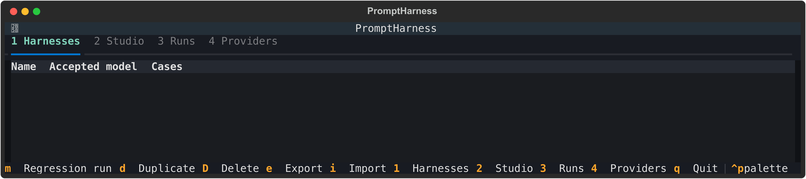
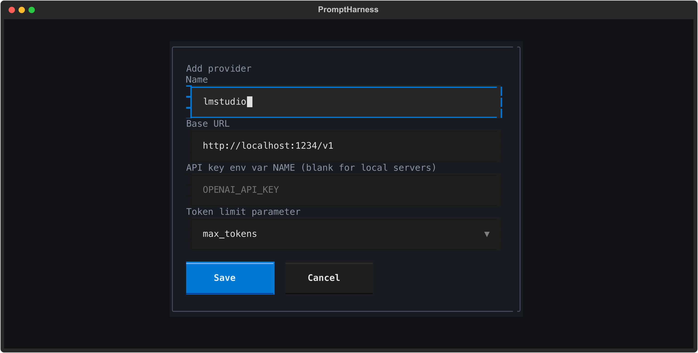
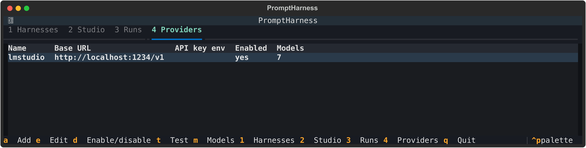
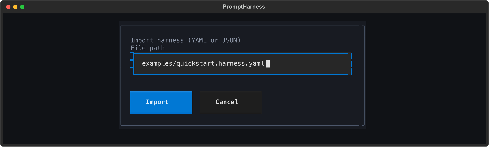
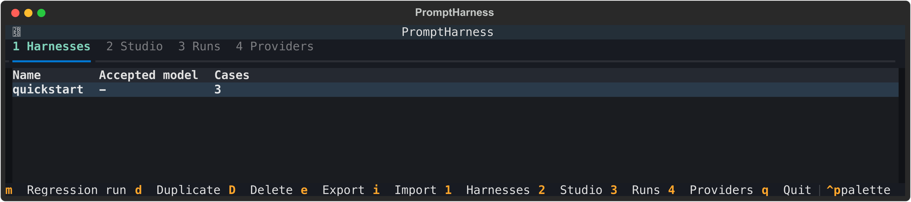
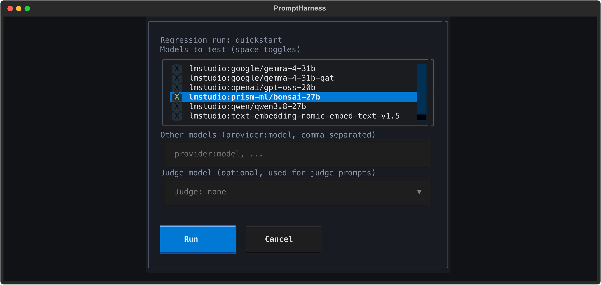
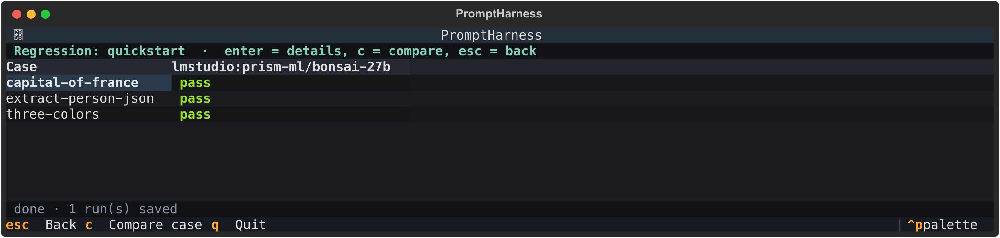
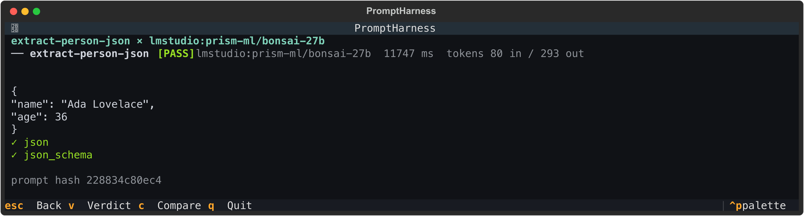
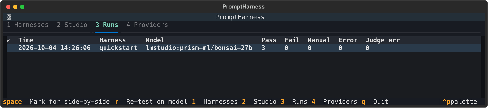

# Getting started

This guide takes you from nothing installed to your first passing test in about ten minutes. You will connect a model server, load a ready-made test, and run it. Every screenshot below was taken from a real run of these exact steps.

**What you need**

- Python 3.11 or newer and [uv](https://docs.astral.sh/uv/) (or plain `pip`).
- Something that serves an OpenAI-compatible chat API. The easiest option is a local server such as [LM Studio](https://lmstudio.ai/) or [Ollama](https://ollama.com/), which needs no account or API key. A hosted provider such as OpenAI works too, see [Using a hosted provider](#using-a-hosted-provider) at the end.
- At least one model downloaded and available in that server.

## 1. Install PromptHarness

```sh
uv tool install git+https://github.com/pmirvine/prompt-harness.git
```

This installs the `promptharness` command, with the starter test case bundled. No clone is needed. Without uv, use `pip install git+https://github.com/pmirvine/prompt-harness.git` (in a virtual environment) instead.

Working from a clone instead, to hack on it? Run `git clone https://github.com/pmirvine/prompt-harness.git`, then `cd prompt-harness && uv venv && uv pip install -e .`, and put `uv run` in front of `promptharness` in the commands below.

## 2. Start your model server

**LM Studio:** open the Developer tab, load a model, and start the server. It listens on `http://localhost:1234` by default. LM Studio can also load a model on demand the first time a request names it.

**Ollama:** run `ollama serve` (if it is not already running) and `ollama pull llama3.2` or any model you like. It listens on `http://localhost:11434`.

You can check the server is up with `curl http://localhost:1234/v1/models` (use port `11434` for Ollama). You should get a JSON list of model ids.

## 3. Launch the app

```sh
promptharness
```

You land on the **Harnesses** tab, which is empty. A *harness* is a saved prompt with test cases; you will import one in step 5. The keys available on the current screen are always listed in the footer.



## 4. Add your model server as a provider

A *provider* is any server that speaks the OpenAI chat API.

1. Press `4` to open the **Providers** tab, then `a` to add one.
2. Fill in the form:
   - **Name:** anything you like, for example `lmstudio`. You will use it in model names such as `lmstudio:your-model`.
   - **Base URL:** `http://localhost:1234/v1` for LM Studio, or `http://localhost:11434/v1` for Ollama.
   - **API key env var NAME:** leave this blank for a local server. For a hosted provider you enter the *name* of an environment variable that holds your key, never the key itself.
   - **Token limit parameter:** leave the default, `max_tokens`.
3. Press `Tab` four times to reach **Save** and press `Enter` (or click it).



4. With the provider selected in the table, press `t` to test the connection. PromptHarness asks the server for its model list and stores it. The **Models** column shows how many it found.



If the connection fails, a message tells you why and offers a box where you can type model ids by hand, one per line. Press `m` later to reopen that box.

## 5. Import the starter harness

PromptHarness bundles a starter harness called `quickstart`: three tiny tests that any chat model should pass. (Run `promptharness examples` to list everything bundled.)

| Test | What it checks |
|------|----------------|
| `capital-of-france` | The answer contains `Paris` and not `London` |
| `extract-person-json` | The answer is valid JSON with a string `name` and an integer `age` |
| `three-colors` | The answer is exactly three lowercase colors separated by commas |

1. Press `1` to go back to the **Harnesses** tab, then `i` to import.
2. Type `example:quickstart` (the name of the bundled harness; you can also type the path to your own YAML file) and press `Tab` to the **Import** button, then `Enter`.



`quickstart` now appears in the list with 3 cases. Its accepted model is `-` because the starter harness is deliberately not tied to any model.



## 6. Run your first test

1. With `quickstart` selected, press `m` to start a regression run.
2. In **Models to test**, move with the arrow keys and press `Space` to tick the model you want. A ticked model has a bright green `X`. Leave the other boxes unticked for now.
3. Press `Tab` three times (past the *Other models* box and the *Judge* menu) to reach **Run**, and press `Enter`.



PromptHarness sends each test to the model and checks the reply. A small local model usually takes a few seconds to a minute for all three tests; models that "think" before answering take longer.

## 7. Read the results

When the run finishes you see a grid of tests down the side and models across the top. Each cell is `pass`, `fail`, `error`, or `manual` (no automatic check decided it, so you judge it yourself).



Move to a cell with the arrow keys and press `Enter` to see exactly what the model said, how long it took, how many tokens it used, and which checks passed. Press `Esc` to go back.



If a test fails, the same screen explains why, for example `include:Paris: pattern not found`. Press `v` there to record your own pass or fail verdict.

Every run is saved. Press `Esc` out of the results, then `3` to see the **Runs** tab, a history of everything you have run.



**You have run your first tests.** To use more than one model, tick several in step 6 and the grid gets one column each. The `c` key on a test compares every model's answer side by side.

## The same thing from the command line

Everything above is also available without the interface, which is handy for scripts and CI:

```sh
promptharness provider add lmstudio --base-url http://localhost:1234/v1
promptharness import --example quickstart
promptharness run quickstart --model lmstudio:your-model-id
```

`run` prints the same grid, explains any failures underneath, and exits with `0` when everything passed or `1` otherwise. Replace `your-model-id` with an id from `curl http://localhost:1234/v1/models`.

## Using a hosted provider

Hosted providers need an API key, which PromptHarness reads from an environment variable. The quickest way is a `.env` file in the folder you launch from:

```sh
cp .env.sample .env
```

Edit `.env` and replace the placeholder for your provider, for example `OPENAI_API_KEY=sk-...`. In step 4, set the **Base URL** to the provider's endpoint (`https://api.openai.com/v1` for OpenAI) and put the variable's *name*, `OPENAI_API_KEY`, in **API key env var NAME**. `.env.sample` lists the endpoints for OpenAI, Anthropic, Google Gemini, Amazon Bedrock, and several others. `.env` is ignored by git, so your keys are never committed.

## Troubleshooting

**A test fails and the answer is empty.** Reasoning models spend part of the token limit thinking before they answer. If the limit is too small they return nothing, and the result shows a warning such as `empty answer: the model used its token limit ... raise max_tokens`. The starter harness already allows 2048 tokens. If you write your own harness, raise the max tokens field (placeholder `max tok`) in the Studio.

**`error — config: environment variable ... is not set`.** The provider names an API key variable that is not set. Put it in your `.env` file or export it in the shell you launched from, or leave the field blank for a local server.

**`error — auth: ...`.** The server rejected the key. Check the value in `.env`, and that the provider's base URL matches the key.

**`error — timeout`.** The model did not answer within the provider's timeout (60 seconds by default). Large models, or a server that has to load a model first, can be slow. Try a smaller model, or run it once so the server has it loaded. To wait longer, raise the provider's timeout: `promptharness provider add lmstudio --timeout 300`, or press `4`, select the provider, press `e` and fill in **Timeout (s)**. The error only appears after the retries (two by default, **Max retries** in the same form), so with the default 60 seconds it takes about three minutes.

**LM Studio refuses to load a model ("insufficient system resources").** LM Studio's memory guard is stopping a load that would not fit. Lower that model's context length in LM Studio, or unload other models first.

**The model is not in the list.** Press `4`, select the provider, and press `t` again to refresh it, or press `m` to type the id by hand.

## Where to go next

- Open the **Studio** (`2`) to write your own prompt, add test cases, try them against a model, and save the result as a harness. See [Screenshots](../README.md#screenshots) in the main README.
- Follow [Working with documents](working-with-documents.md) to build a test that reads a Word file, a PDF and an image, from a vague first prompt to a checked, judged harness run on two models.
- Re-run a saved harness against a different model to check it still behaves, or press `r` on the Runs tab to re-test a past run on a replacement model.
- Read [Checks and statuses](../README.md#checks-and-statuses) to learn about regex checks, JSON Schema checks and the optional LLM judge.
- Export a harness to YAML or JSON so it can live in git: [Export and import](../README.md#export-and-import).
