# Working with documents

This guide follows on from [Getting started](getting-started.md). You will build a test whose answer depends on three documents (a Word file, a PDF and an image), start from a deliberately vague prompt, and improve it step by step until the model reliably gives the same, checkable answer. Then you will save it, run it on a second model, and export it to share.

Everything below, including every model answer, comes from real runs against LM Studio on a laptop. Your model may word its answers differently, and your timings will differ, but the steps and the kinds of results will be the same.

**What you need**

- PromptHarness set up as in [Getting started](getting-started.md), with LM Studio added as a provider called `lmstudio`.
- A model that accepts images (a *vision* model). This guide uses `prism-ml/bonsai-27b`, and `google/gemma-4-31b-qat` as the second model and the judge. To see which of your LM Studio models accept images, run `curl http://localhost:1234/api/v0/models`: they are the ones with `"type": "vlm"`. A model without vision support cannot read the image; see [When things go wrong](#when-things-go-wrong).

## 1. Get the sample documents

The three sample invoices are in the repository, in [`docs/sample-documents/`](sample-documents/):

| File | Kind | What it says |
|------|------|--------------|
| `invoice-1041.docx` | Word | ACME Supplies, total 120.00 EUR, due 2026-11-01 |
| `invoice-1042.pdf` | PDF | Borealis Ltd, total 80.50 EUR, due 2026-11-15 |
| `invoice-1043.png` | image | Cobalt GmbH, total 200.00 EUR, due 2026-12-01 |

So the right answer is a total of **400.50 EUR**, and the first payment is due on **2026-11-01**. Notice that the largest invoice is only in the image: a model that cannot see the image cannot get the total right.

Get the files in one of two ways:

- **Clone the repository** and launch PromptHarness from inside it, so the paths in this guide work as written:

  ```sh
  git clone https://github.com/pmirvine/prompt-harness.git
  cd prompt-harness
  promptharness
  ```

- **Or download the three files** from [the folder on GitHub](https://github.com/pmirvine/prompt-harness/tree/main/docs/sample-documents) (open each file and use the download button), for example into `~/invoices/`. Then type `~/invoices/invoice-1041.docx` and so on wherever this guide says `docs/sample-documents/...`.

## 2. Create a case with three documents

A *case* is one test: an input, any documents, and later the checks that decide whether the answer is right.

1. Press `2` to open the **Studio**.
2. Click the **Model** menu at the top left and choose `lmstudio:prism-ml/bonsai-27b` (with the keyboard: move to the menu, press `Enter`, use the arrow keys, press `Enter`).
3. Leave the **System prompt** empty and the **User template** as it is (`{{ input }}`). This is our vague first prompt.
4. Click the case list (the empty box on the right) so it has focus, and press `n` to add a case. Fill in:
   - **Name:** `invoices`
   - **Input:** `How much do I owe on these invoices, and when is the first one due?`
   - **Document paths:** the three files, separated by commas:

     ```
     docs/sample-documents/invoice-1041.docx, docs/sample-documents/invoice-1042.pdf, docs/sample-documents/invoice-1043.png
     ```

   Relative paths are resolved against the folder you launched `promptharness` from, and stored as full paths. `~` works too.
5. Scroll down and click **Save** (or press `Tab` until it is highlighted and press `Enter`).

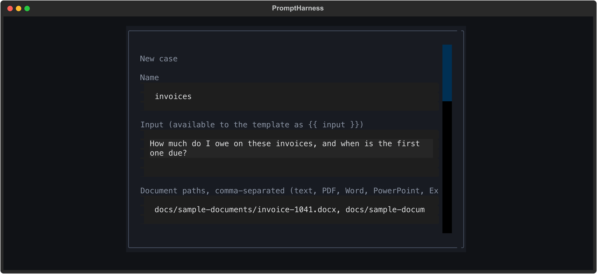

## 3. Run the vague prompt

With the case selected in the list, press `r` to run it. Bonsai is a model that thinks before it answers, so a run takes between about 15 seconds and a minute here; the status line above the case list says `● running…` until it is done.

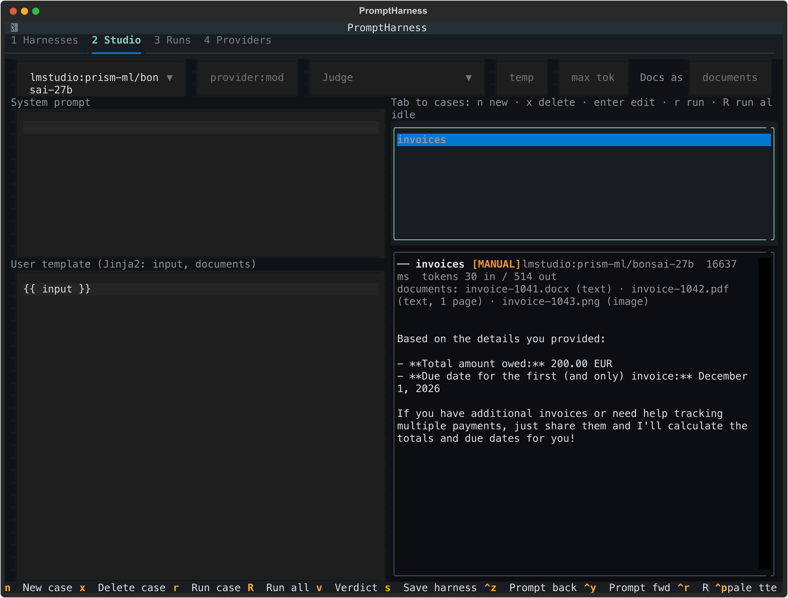

The real answer:

```
Based on the details you provided:

- **Total amount owed:** 200.00 EUR
- **Due date for the first (and only) invoice:** December 1, 2026

If you have additional invoices or need help tracking multiple payments, just share them and I'll calculate the totals and due dates for you!
```

The model says there is only one invoice. The line under the result header, `documents: invoice-1041.docx (text) · invoice-1042.pdf (text, 1 page) · invoice-1043.png (image)`, shows that all three documents were loaded, so what went wrong?

**The template decides what the model sees.** PromptHarness reads the Word file and the PDF as text, but text only reaches the model if the template puts it into the prompt. The template is just `{{ input }}`, so the model got the question and nothing else. Images are the exception: an image document is always attached to the request, which is why the model found the 200.00 EUR invoice. (Another run of this same prompt said "Since only one invoice is provided here"; same mistake, different words.)

The case shows `[MANUAL]` because it has no checks yet, so nothing decides pass or fail automatically.

## 4. Put the documents in the template

The template sees the case's documents as a list called `documents`, in the order the case lists them. Each one has a `name` (the file name), its `text`, and a few more fields (`kind`, `mime`, `index`, `pages`). You can refer to one document by position, for example `{{ documents[0].text }}` for the Word file, or loop over all of them. For an image, `text` is just a marker such as `[attached image: invoice-1043.png]`, which tells the model where the attached picture belongs.

1. Click the **User template** editor and replace its contents with:

   ```jinja
   {{ input }}

   {{ d.name }}:
   {{ d.text }}

   
   ```

2. Press `ctrl+r`. It runs the selected case from anywhere, including while you are typing in an editor.

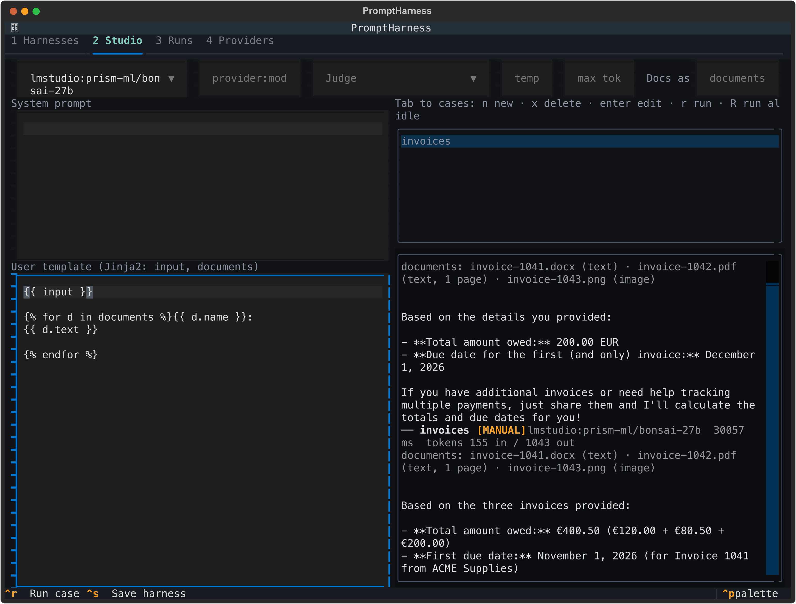

The real answer (30 seconds):

```
Based on the three invoices provided:

- **Total amount owed:** €400.50 (€120.00 + €80.50 + €200.00)
- **First due date:** November 1, 2026 (for Invoice 1041 from ACME Supplies)
```

The facts are right now. But the answer is prose with Markdown, the date is written out in words, and the next run may phrase it differently. That is fine for a person and awkward for a program, and impossible to check reliably. Let's ask for a fixed format.

## 5. Ask for JSON

1. Click the **System prompt** editor and type:

   ```
   You read invoices and answer with a single JSON object and nothing else: no Markdown, no code fences, no explanation.
   Use exactly these keys:
   - "total": the sum of all the invoice totals in EUR, as a number (for example 12.5)
   - "earliest_due": the earliest due date, as a string in the form YYYY-MM-DD
   Read every document, including any images.
   ```

2. Press `ctrl+r`.

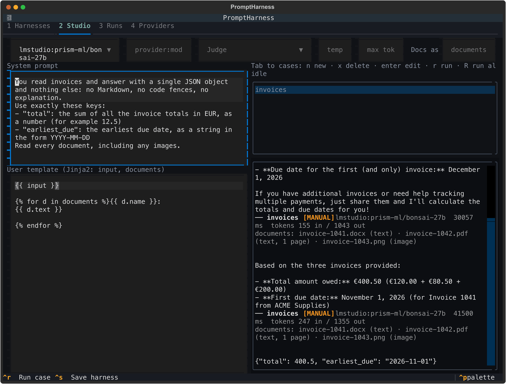

The real answer (42 seconds):

```
{"total": 400.5, "earliest_due": "2026-11-01"}
```

That is exactly what we want. (Bonsai puts two blank lines before its answers; JSON checks ignore surrounding whitespace.) Next, make PromptHarness check it, so you no longer have to read every answer yourself.

## 6. Add checks

1. Click the `invoices` case to edit it (or move to the case list with `Tab` and press `Enter`).
2. Scroll down and fill in:
   - **Must include (one per line):**

     ```
     400.5
     2026-11-01
     ```

   - Tick **Output must be valid JSON** (click it, or move to it and press `Space`).
   - **JSON Schema (optional):**

     ```json
     {
       "type": "object",
       "required": ["total", "earliest_due"],
       "properties": {
         "total": {"type": "number"},
         "earliest_due": {"type": "string", "pattern": "^\\d{4}-\\d{2}-\\d{2}$"}
       }
     }
     ```

3. Click **Save**.

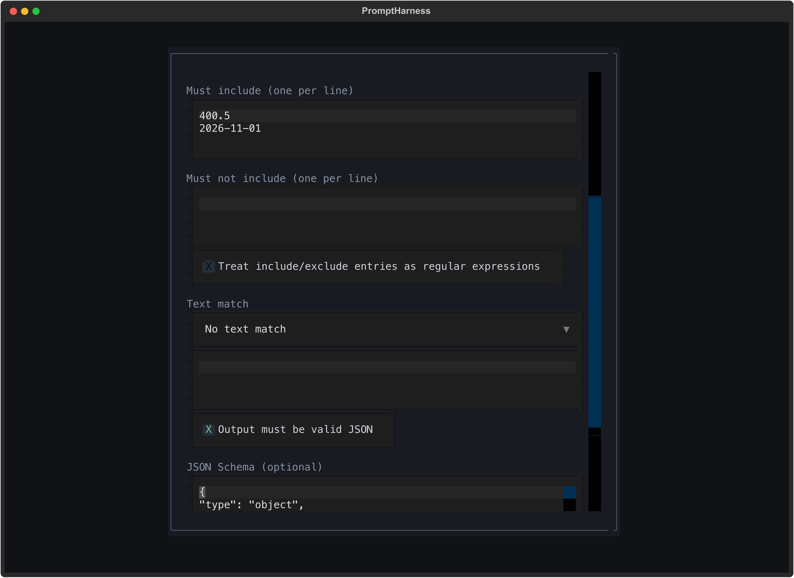

Press `r` to run it again. Every check passes (21 seconds):

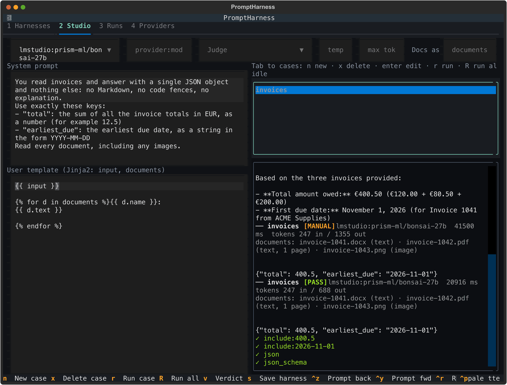

```
{"total": 400.5, "earliest_due": "2026-11-01"}
  ✓ include:400.5
  ✓ include:2026-11-01
  ✓ json
  ✓ json_schema
```

## 7. Compare with the previous prompt

The Studio keeps a history of your prompt versions: a version is recorded each time you run, and whenever you pause typing for two seconds. Step back and forth through it with `ctrl+z` and `ctrl+y` while the case list has focus (inside an editor those keys undo and redo your typing, so use `alt+left` and `alt+right` there).

1. With the case list focused, press `ctrl+z`. The system prompt empties and the template is the loop from step 4: the prose version. (If you paused while typing, there may be in-between versions; press `ctrl+z` again until you reach it.)
2. Press `r` to run that old prompt against the new checks.

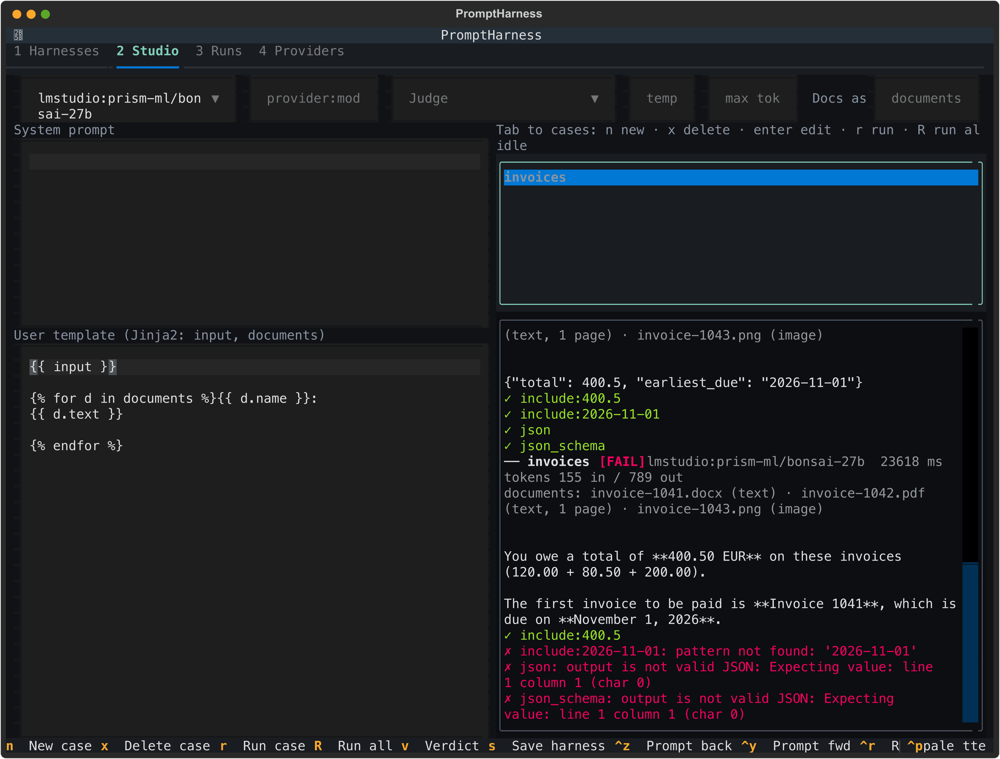

The real result (24 seconds):

```
You owe a total of **400.50 EUR** on these invoices (120.00 + 80.50 + 200.00).

The first invoice to be paid is **Invoice 1041**, which is due on **November 1, 2026**.
  ✓ include:400.5
  ✗ include:2026-11-01: pattern not found: '2026-11-01'
  ✗ json: output is not valid JSON: Expecting value: line 1 column 1 (char 0)
  ✗ json_schema: output is not valid JSON: Expecting value: line 1 column 1 (char 0)
```

The answer is correct for a human, but the checks show exactly why it is not good enough for a program. Press `ctrl+y` to return to the JSON prompt, and `r` to confirm it still passes (it did, in 46 seconds).

## 8. Choose your own name for the documents

`documents` is only the default name. If you prefer a shorter one, type it in the **Docs as** field at the top right. Exactly one name is active, so the template must use it.

1. Click **Docs as** and type `doc`.
2. Press `ctrl+r` without changing the template, to see what happens when the names do not match. (Use `ctrl+r` here: while a text field has focus, a plain `r` is typed into it.)

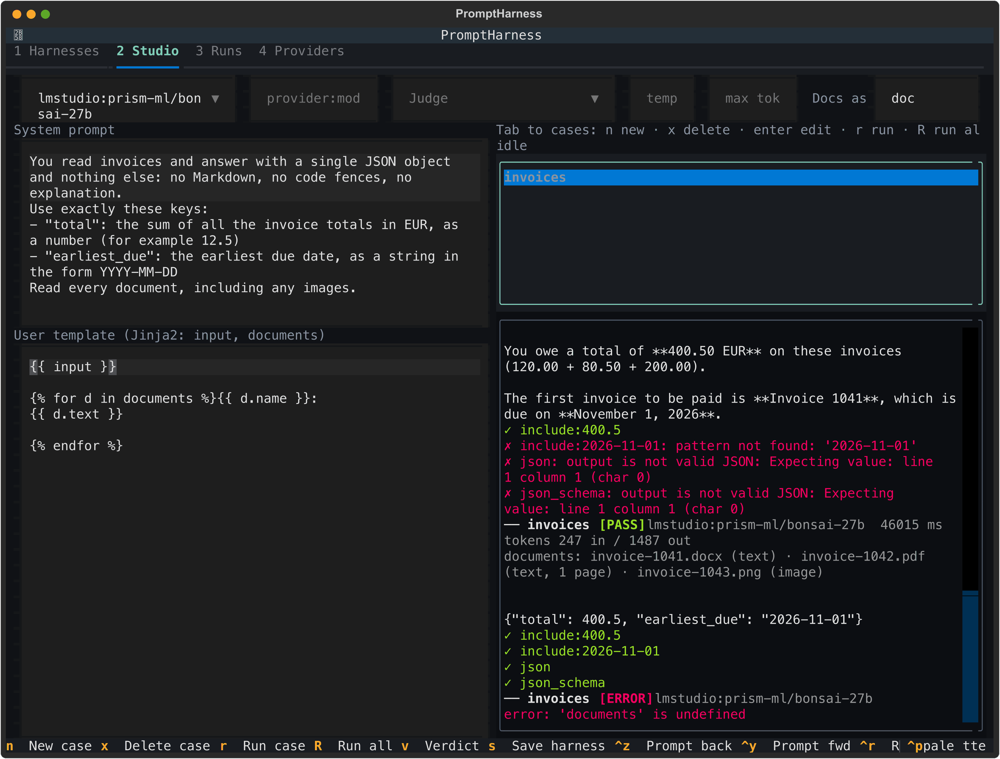

```
── invoices [ERROR]  lmstudio:prism-ml/bonsai-27b
  error: 'documents' is undefined
```

Nothing is sent to the model: the template cannot be filled in, so the case stops with `error`.

3. In the template, change `` to ``, so it reads:

   ```jinja
   {{ input }}

   {{ d.name }}:
   {{ d.text }}

   
   ```

4. Press `ctrl+r`. It passes again (55 seconds).

## 9. Add a judge

Checks are good at exact facts. For a criterion that needs judgement, add a *judge prompt*: a second model reads the answer and decides pass or fail. The judge always receives the case's documents (text, and the image attached), and the judge prompt can refer to them by the same name as the template.

1. Click the `invoices` case (or press `Enter` on it in the case list) to edit it, scroll to the bottom, and type this in **Judge prompt (optional; needs a judge model)**:

   ```jinja
   The answer must give the combined total of {{ doc[0].name }}, {{ doc[1].name }} and {{ doc[2].name }} in EUR, and the due date of whichever of them is due first. Check both figures against the documents.
   ```

   PromptHarness fills in the names before the judge sees it, so the judge reads "...the combined total of invoice-1041.docx, invoice-1042.pdf and invoice-1043.png...".

2. Click **Save**.

   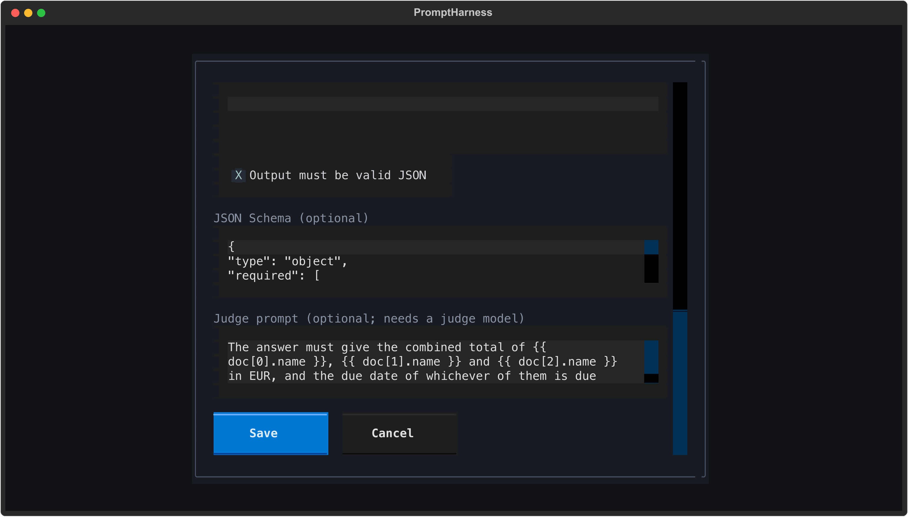

3. Click the **Judge** menu at the top and choose `lmstudio:google/gemma-4-31b-qat`. The judge needs to accept images too, because it is sent the image. A judge prompt is skipped when no judge model is chosen.
4. Press `ctrl+r`.

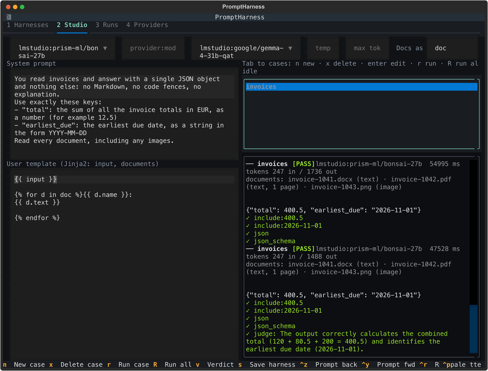

The real result (48 seconds for the answer, plus the judge):

```
{"total": 400.5, "earliest_due": "2026-11-01"}
  ✓ include:400.5
  ✓ include:2026-11-01
  ✓ json
  ✓ json_schema
  ✓ judge: The output correctly calculates the combined total (120 + 80.5 + 200 = 400.5) and identifies the earliest due date (2026-11-01).
```

## 10. Save it as a harness

1. Press `ctrl+s` (or `s` while the case list has focus).
2. **Name:** `invoice-totals`. **Description:** anything you like, for example `Total and earliest due date of three invoices (Word, PDF, image)`.
3. Click **Save**.

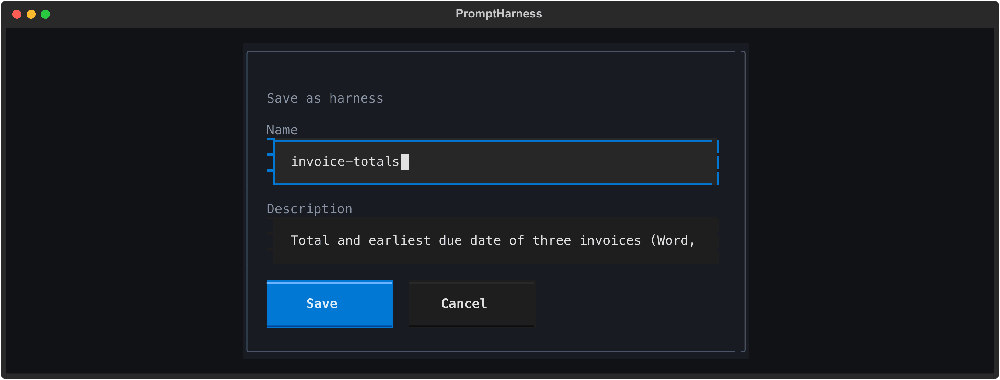

The harness keeps the prompt (including the `doc` name), the case with its documents and checks, and this last result as the *accepted* run for bonsai.

## 11. Run it on a second model

1. Press `1` for the **Harnesses** tab. `invoice-totals` is selected.
2. Press `m` for a regression run.
3. In **Models to test**, move with the arrow keys and press `Space` to tick `lmstudio:prism-ml/bonsai-27b` and `lmstudio:google/gemma-4-31b-qat`.
4. In **Judge model**, choose `lmstudio:google/gemma-4-31b-qat`. Here it also judges its own answer, which PromptHarness allows but warns about, because a model grading itself is less independent. Choose a third vision model if you have one.
5. Click **Run**.

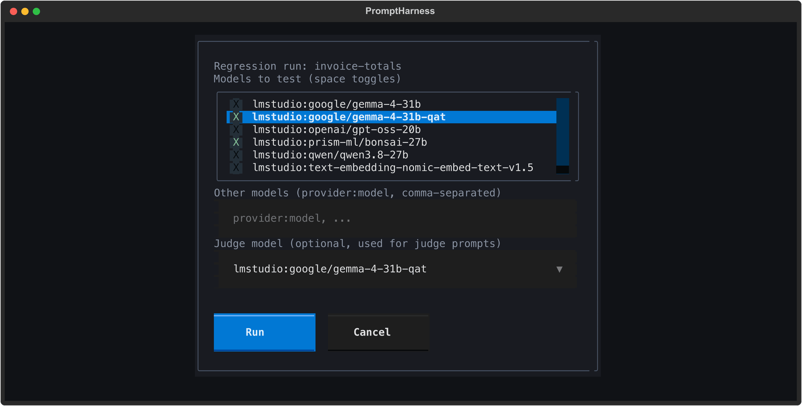

Both models pass (bonsai in 43 seconds, gemma in 23):

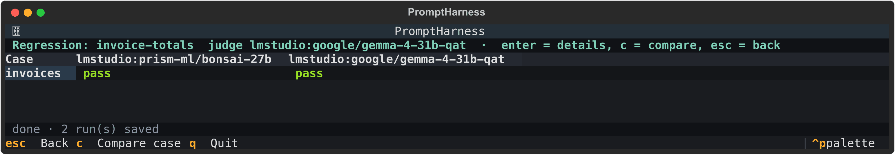

Press `c` on the case to compare the answers side by side. The first column is the accepted answer you saved from the Studio.

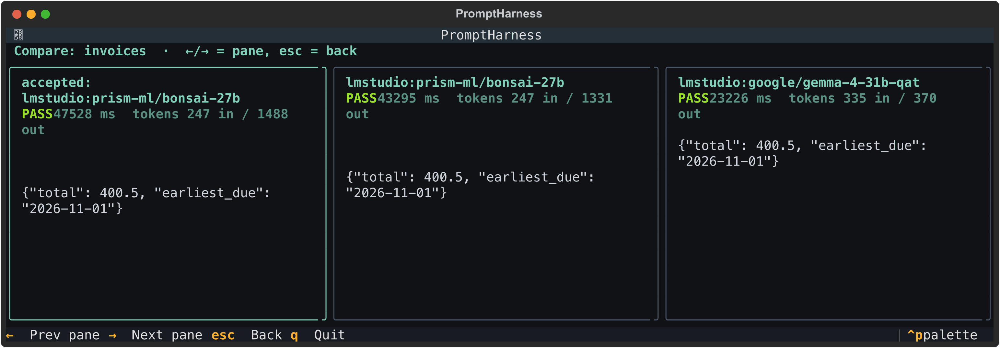

The answers are identical; the differences are in speed and tokens. Gemma did not "think" first, so it used fewer output tokens (370 against 1331 and 1488 here) and does not start with blank lines. Press `Esc` twice to go back.

## 12. Export it to share

A harness file normally lists its documents as paths on your machine, which mean nothing on someone else's. Inlining fixes that.

1. On the **Harnesses** tab, with `invoice-totals` selected, press `e`.
2. Keep the file path `invoice-totals.yaml` (it is written to the folder you launched from) and the YAML format.
3. Tick **Inline document contents**.
4. Click **Export**.

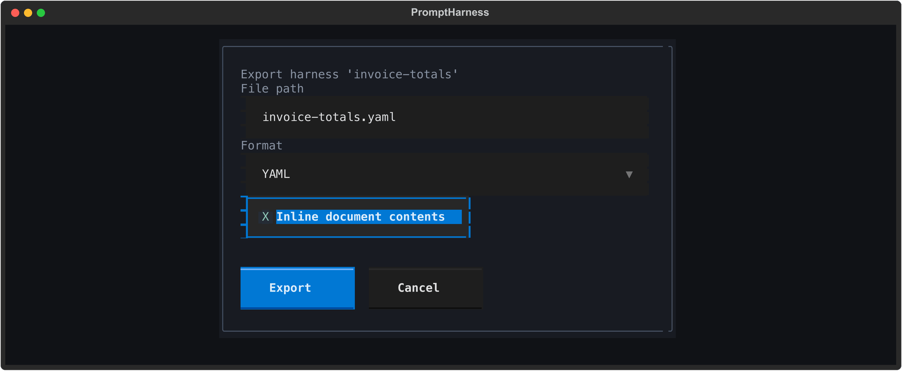

The file now contains a copy of each document: the PDF as text (it happens to be plain text inside), and the Word file and the image as base64 data, about 69 KB in all. The prompt keeps `documents_name: doc`. When someone imports the file (`1`, then `i`, or `promptharness import invoice-totals.yaml`) and the original paths do not exist on their machine, PromptHarness writes the documents to `documents/invoice-totals/` in their data directory and points the case at them, so the harness runs straight away. Each inlined file can be at most 10 MB. The same from the command line:

```sh
promptharness export invoice-totals --inline-documents --out invoice-totals.yaml
```

## When things go wrong

**The model cannot read images.** With a model that has no vision support, the case ends with `error` and the server's message, plus a hint from PromptHarness. Running this case on `openai/gpt-oss-20b` gave:

```
error: other: Error code: 400 - {'error': {'message': 'The provided messages contain images, but openai/gpt-oss-20b does not support image inputs.', 'type': 'invalid_request_error', 'param': 'messages', 'code': 'invalid_value'}} (the model may not support image input)
```

Choose a vision model, or remove the image from the case. A judge model that cannot read images fails the same way. There is no OCR fallback.

**A scanned PDF.** A PDF that is only pictures of pages has no text to read. A PDF with no text on any page stops the case:

```
error: unsupported: /path/to/scan.pdf: no extractable text; it may be a scan. Convert the pages to images and attach those
```

If only some pages are blank, the case runs and the result shows a warning such as `scan.pdf: page 2 has no extractable text`.

**The template uses the wrong name.** `error: 'documents' is undefined` (or `'doc' is undefined`) means the template uses a different name from the **Docs as** field, and the case stops before anything is sent to the model. Make them match; an empty **Docs as** means `documents`.

The judge prompt follows the same name, but a mistake there shows up differently: the model still answers and the checks still run, then the case ends with `JUDGE_ERROR` and a warning instead of an error. For example, a judge prompt that uses `{{ doc[0].name }}` while **Docs as** is empty gives:

```
! warning: judge: judge prompt template error: 'doc' is undefined
```

**A document path does not exist.** A typo in a path, or launching from a different folder when the paths are relative, stops that case and names the full path it tried:

```
error: unsupported: /path/to/prompt-harness/docs/sample-documents/invoice-1044.pdf: cannot read (No such file or directory)
```

Edit the case (`Enter`) and fix the path. Other cases in the same run carry on.

**`error: timeout: Request timed out.`** PromptHarness waits 60 seconds for an answer, and tries twice more before giving up, so this error appears after about three minutes. Bonsai usually took 13 to 55 seconds per answer in these runs, because it reasons before answering, and once took 63 seconds (that run had a longer limit, set for making these screenshots). So bonsai can go over the limit even on a fast machine, more so on a slower one or while the model is still loading; when only one attempt is too slow, the retry may still succeed and you just wait longer. The 60 second limit cannot be changed from the app yet (neither the provider form nor the command line has a setting for it). Instead you can: run the case again once the model is loaded and warm; use a smaller model, or one that answers without thinking first (gemma took 19 to 27 seconds here); or shorten the prompt and the documents, since long inputs take longer to read.

For empty answers, missing API keys and other general problems, see [Troubleshooting](getting-started.md#troubleshooting) in the getting-started guide, and the [Documents](../README.md#documents) section of the README for every supported format and limit.
